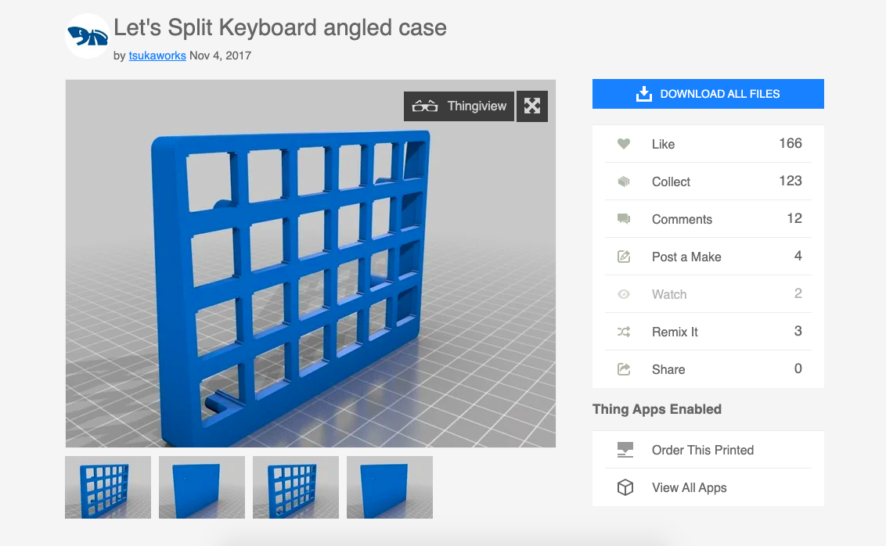
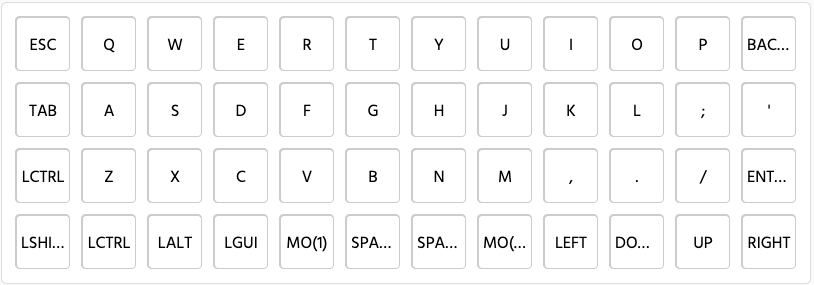
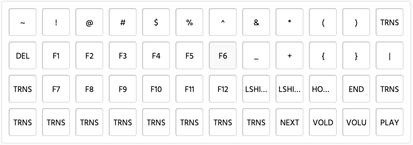
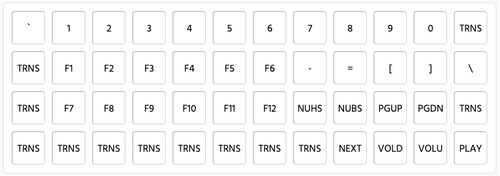
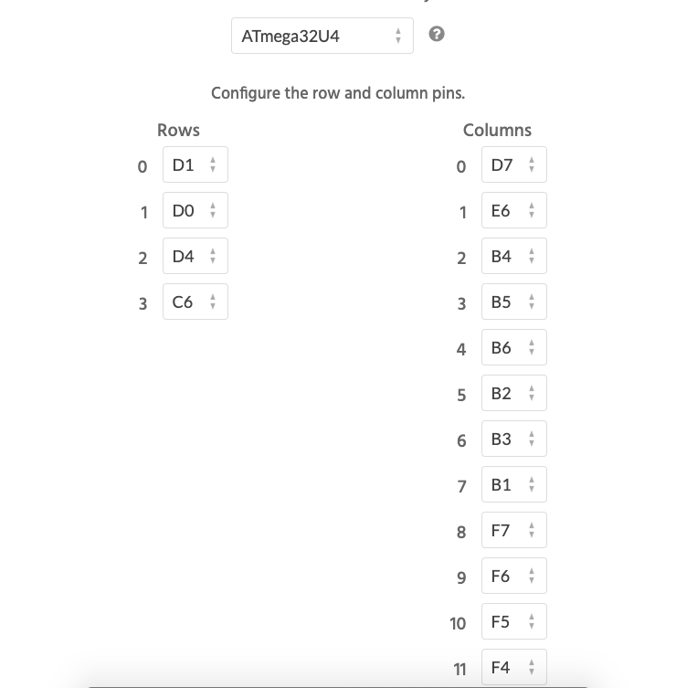
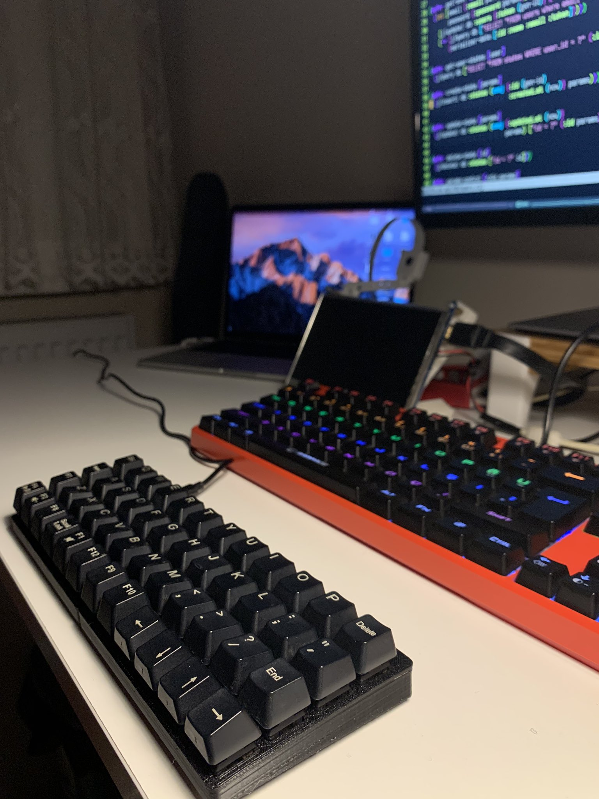

# My custom keyboard

## Case
[Thingiverse](https://www.thingiverse.com/thing:2626039)



## Create keyboard layout
[keyboard-layout-editor](http://www.keyboard-layout-editor.com/)

You can create your keyboard layout in this address.

```
 _________________________________________

| [X][X][X][X][X][X] | [X][X][X][X][X][X] |
| [X][X][X][X][X][X] | [X][X][X][X][X][X] |
| [X][X][X][X][X][X] | [X][X][X][X][X][X] |
| [X][X][X][X][X][X] | [X][X][X][X][X][X] |
 _________________________________________
```

## Keyboard firmware
[kbfirmware](https://kbfirmware.com/)

You can create your keyboard firmware in this address.

### Keymap
**Normal**

**Layer-1**

**Layer-2**


### Pins


# Result

